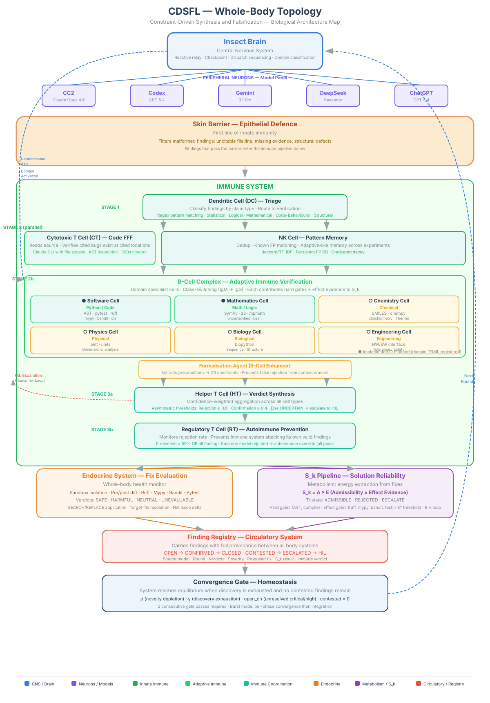

# CDSFL: Constraint-Driven Synthesis and Falsification

*A Metacognitive Framework For Multi-Vendor LLM Co-ordination.*

---

## 1. Popperian Falsification, and the Architecture of Scientific Cognition

### Abstract

Science is not only a body of knowledge. It is a method for correcting error. Its power does not come from eloquence, confidence, or consensus, but from a disciplined process of proposing claims, exposing them to possible refutation, retaining what survives, and revising what fails. The CDSFL project began, for me, from a precise and ambitious question: can that method itself be encoded as transferable procedure, rigorous mathematics, and executable control architecture for mixed human and machine analytical systems?

This document argues that, within clear boundaries, the answer is substantially yes. In CDSFL, the scientific method is not invoked rhetorically as a background ideal. The framework attempts to make it operational. Popperian falsification becomes an explicit loop, called the P-Pass, in which a proposed answer is generated, attacked, repaired, and attacked again until diminishing returns are reached. Constraint identification becomes a formal HARD/SOFT classification system. Peer review becomes a tiered architecture of independent falsifiers. Scientific uncertainty becomes a mathematical object through models of corroboration, structured detection, residual risk, calibrated expertise, distributed review, literature novelty, generator-side divergence, and metacognitive feedback. Persistence and verification become architectural components rather than administrative afterthoughts.

CDSFL does not claim that all intelligence is reducible to scripting, nor that procedure can create competence from nothing. The framework's substrate-ceiling formalism rules out that overstatement. What the framework does claim is that a significant fraction of intelligence-like organisation — including disciplined self-correction, structured peer review, metacognitive monitoring, adaptive allocation of effort, and cumulative methodological evolution — can be formalised as procedure and studied as an engineering object in its own right.

The significance of this move is considerable. If scientific method can be encoded in this way, then scientific cognition is no longer located only in the human expert or only in the trained model. It is also present in the formal discipline that governs how experts and models generate, criticise, revise, and preserve analytical work. The result, as the argument below develops, is best understood not as a benchmark harness or prompt schema, but as the outline of a protocol-level architecture for scientific cognition.

The methodological move at the heart of this project is not incidental. CDSFL runs as a heterogeneous panel of five frontier models from four independent vendors — Claude Opus 4.7 (Anthropic), Codex GPT-5.5 and ChatGPT GPT-5.5 (OpenAI), Gemini 3.1 Pro Preview (Google), and DeepSeek V4 Pro (DeepSeek) — co-ordinated under a single falsification discipline. (The panel is rotated to current frontier on a rolling basis; the versions named here reflect the panel as of 14 May 2026, smoke-tested before each substantive review. Earlier sessions in this document's history reference the prior versions of these models because those versions were in service at the time of those events. The methodology is independent of any specific model version.) Treating disagreement between unlike models as compute, rather than as noise to be averaged or voted away, is the project's most distinctive structural commitment. Models trained under different curricula, objectives, tokenisers, and safety regimes fail in different places; putting them in disciplined confrontation under a shared protocol turns those different blind spots into signal rather than noise. No framework known to the project at time of writing operates frontier models from multiple independent vendors under a Popperian falsification protocol in this way, which is why this document's subtitle names CDSFL as a framework for multi-vendor LLM co-ordination.

Two further commitments sit alongside that panel structure and are load-bearing throughout the document. First, the models on the panel are not asked to reason purely from their own weights. They reason *through* a defined envelope of external verification tools — symbolic mathematics, constraint solvers, static and dynamic code analysis, unit and dimensional checks, literature search, and domain-specific specialist libraries — and their conclusions are admissible only to the extent those tools underwrite them. Reasoning is permitted; reasoning that substitutes for tool output where a tool could have been used is not. This is what CDSFL calls the *constraint box*, and it pushes the system's behaviour closer to deterministic verification than to the purely statistical pattern-completion more typical of standalone large-language-model use. The Human in the Loop, hereafter the HIL, is the project's second load-bearing commitment: a final decision authority on fix application, stage promotion, and constraint reclassification, sitting over the panel but not inside it. The HIL role is defined functionally and is substrate-agnostic in principle, a point taken up in §9. The framework uses a biological analogy — an immune pipeline of cell-typed validation agents — as its organising metaphor for the internal validation layer; that analogy is introduced briefly where it first appears and explained in full in §8 and §9.

CDSFL is released under the MIT License. It is fundamentalist open source. Its purpose is to make AI-assisted technical work demonstrably more reliable and to inspire new ways of engaging in scientific research. Commercial portability is a downstream consequence of that purpose. It is not the originating goal. The project prefers open-source verification tools wherever an open-source alternative exists of comparable fitness for purpose; proprietary tools are used only as local cross-checks by the framework's developers, never as primary evidence in the admissibility chain.

---

## 2. Introduction: Science as Error-Correction

The central practical defect of current large language models is not simply that they make mistakes. All analytical systems make mistakes. The deeper defect is that they often fail in the opposite way from science.

Science advances by making itself vulnerable to error. A claim must be stated clearly enough to be challenged. A method must expose itself to failure conditions. A result must survive scrutiny stronger than the preference of its author. In this sense, science is a discipline for not trusting oneself too easily.

Modern language models tend to exhibit the reverse behaviour. They often present weak inferences, partial knowledge, and outright guesses in the same register of certainty. They optimise for fluent usefulness and local agreement even when the underlying claim should still be under attack. They do not naturally preserve the history of what has already been refuted. They frequently collapse the distinction between what appears plausible and what has survived serious criticism.

The CDSFL project began, for me, from the proposition that this mismatch is not incidental. It is methodological. If modern AI systems are to participate usefully in serious technical work, they cannot be asked merely to generate answers more impressively. They must be placed inside a discipline closer to science itself.

That is the starting premise of the project:

> Can the scientific method itself be encoded as method, mathematics, and code?

This question is narrower and stronger than many adjacent ones. It is narrower than the question of artificial general intelligence. It is stronger than the question of whether prompts can be improved. It asks whether the core structure of scientific reasoning — hypothesis, attack, repair, corroboration, calibration, replication, and cumulative preservation — can become explicit, transferable, and engineerable.

If the answer is yes, even in limited form, then the consequences are significant. Scientific reasoning is no longer only a tacit craft exercised by trained individuals, nor only a property latent in large models. It also becomes an object that can be formalised, benchmarked, executed, and improved.

That is the thesis examined here.

---

## 3. The Foundational Move: From Scientific Ethos to Scientific Procedure

Many technical systems claim to be "scientific" in spirit. Very few attempt to encode science as an operating discipline.

The foundational move CDSFL makes is to turn the scientific method from an ethos into a procedure.

That distinction matters. An ethos says that work should be rigorous, sceptical, and evidence-driven. A procedure says what must happen, in what order, under what stopping condition, and with what record of success or failure. It turns a standard of conduct into a sequence that can be executed.

In CDSFL, this encoding happens at three levels.

The first is procedural. Scientific reasoning is expressed as explicit steps: define the problem, classify its constraints, generate a provisional answer, attack that answer, repair it, and repeat until diminishing returns or boundary conditions are reached.

The second is mathematical. Corroboration, review independence, coverage, residual risk, reviewer calibration, literature novelty, generator-side divergence, and composite improvement are represented as formal quantities rather than loose verbal judgements.

The third is executable. These procedures and models are instantiated in runtime structures: directive registries, review topologies, load balancing, convergence logic, validation layers, literature search, and persistent verification chains.

The significance of that three-part move is easy to underestimate. It means that the scientific method is not merely being recommended. It is being treated as something that can be built.

---

## 4. Popperian Falsification and the P-Pass

The conceptual centre of the project is Popperian falsification.

Karl Popper's contribution to philosophy of science can be stated simply. Scientific knowledge does not gain its authority by collecting confirmations indefinitely. It gains authority by surviving serious attempts at refutation. A theory that survives strong tests is corroborated, not proved. A theory that cannot even in principle be subjected to a test that might show it false is not scientific in the Popperian sense.

CDSFL adopts this principle directly and operationalises it through what the framework calls the P-Pass, short for Popperian falsification pass.

The P-Pass is the engine of the system. It is not a request to "double-check". It is a structured loop:

1. identify the claim, design, proof, or proposal;
2. generate the best current version;
3. actively attempt to destroy it;
4. repair what breaks;
5. attack the repair;
6. continue until further attack yields only diminishing returns or leaves the defined scope.

Several features of this construction are important.

First, the attack phase is active rather than observational. The system is not merely asked whether a problem might exist. It is required to search for failure, construct edge cases, and look for contradictions.

Second, the process is iterative rather than ceremonial. A clean first pass is treated with suspicion, not relief.

Third, the method is proportional. Routine facts and mechanically verifiable claims do not require full adversarial treatment. The deepest loop is reserved for claims whose failure would be consequential and hard to catch downstream.

The P-Pass has two scopes in practice. The standard single-module form is what has been described above: one reasoner attacks one artefact iteratively. The Extended form, used for multi-module work where subsystems interact, adds an isolated adversarial pass performed in a fresh context containing only the work product and a specific adversarial brief — deliberately excluded from the prior review trace so that cross-module contradictions and unstated shared assumptions become visible where component-level review would miss them. That structural separation is doing work: it prevents the adversary from inheriting the reviewers' blind spots.

This is where CDSFL most directly encodes the scientific method as an operational discipline. Popperian falsification is no longer philosophical backdrop. It is runtime behaviour.

---

## 5. Constraint Classification: What Must Not Be Traded Away

Falsification alone is not enough. A system also needs to know what counts as failure.

That is the role of CDSFL's constraint classification layer.

Before synthesis begins, the framework requires constraints to be divided into two classes.

**HARD constraints** are non-negotiable. They include physics, mathematics, law, safety, and explicit absolutes.

**SOFT constraints** are negotiable. They include convenience, cost preference, ergonomic preference, and other tradeable desiderata.

This distinction does more than tidy the problem statement. It blocks a specific failure mode identified here as especially dangerous: quiet substitution.

Quiet substitution occurs when a system silently trades away a non-negotiable requirement in favour of a nicer-looking or more convenient answer and then presents the compromise as if it were valid. This is not merely hallucination. It is a procedural failure to respect necessity.

By forcing the system to classify constraints before synthesis, CDSFL attempts to prevent this class of error structurally. The point is not only to make reasoning more explicit. It is to make unauthorised trade-offs harder to hide.

Constraint classification is paired with two epistemic flags that travel with each claim. `[VERIFY:current]` marks a claim whose truth depends on present-day state — current market prices, regulatory rules, software versions, API contracts — and which must therefore be checked against live sources rather than trusted from training data. `[SPECULATIVE]` marks an untested inference the author believes plausible but has not yet subjected to attack. These flags are not stylistic tics. They allow later reviewers, human or machine, to target their scrutiny correctly. A claim without a flag is a claim the author has staked as verified under present discipline.

The constraint-classification layer has a structural companion that does much of the quiet work of preventing bad trades from ever being proposed. The models on the panel operate inside a defined envelope of external verification tools — symbolic mathematics (SymPy and, for logical and constraint problems, z3), numerical libraries (NumPy, SciPy, mpmath, uncertainties), dimensional-analysis libraries (pint, astropy), static and dynamic code analysis (AST parsing, ruff, mypy, bandit, CrossHair), structural-sanity libraries for specialist domains (RDKit for chemistry, Biopython for biological sequences, NetworkX for graph claims, scikit-learn for machine-learning baselines), and structured literature search across multiple academic indices. The envelope is documented in the project's directive layer and in the model prompts. Its effect is methodological rather than merely practical: a claim within the domain of one of those tools is admissible only to the extent the tool supports it. A model's internal reasoning is permitted to interpret, combine, and explain tool output, and to decide which tool to invoke for a given sub-problem. It is not permitted to substitute for tool output where a tool could have produced evidence. If no tool in the envelope can adjudicate a claim, the claim is recorded as `[SPECULATIVE]` or escalated to the HIL, not pattern-completed into confidence.

The consequence of this arrangement is that the dominant mode of reasoning inside a CDSFL run is closer to deterministic verification than to statistical pattern-completion. Where a standalone language model would generate the next plausible string, a model operating inside CDSFL selects a tool, issues an input the tool can accept, reads the tool's output, and then reasons forward from that output. The model's statistical generativity is still doing work — choosing which question to ask the tool, framing the input, interpreting ambiguous output — but it is no longer the sole source of evidential support. That shift is one of the framework's central structural commitments and is the mechanism by which the constraint box is enforced at runtime rather than merely stated as policy.

---

## 6. The Mathematical Core: Corroboration, Coverage, Risk, and Two Kinds of Novelty

The mathematical layer of CDSFL is one of its most unusual features and one of its least forgiving to poor exposition. Read badly, it can look like decorative formalism. Read carefully, it is an attempt to quantify the internal logic of scientific scrutiny.

The clearest way to understand it is as a sequence of increasingly refined questions. Each question's answer is a strict generalisation of the last — the earlier model is a special case of the later one under simplifying assumptions. The full lineage is recorded in [docs/MATHEMATICAL_APPENDIX.md](docs/MATHEMATICAL_APPENDIX.md).

### 6.1 First Question: How Does Survived Falsification Earn Trust?

The first model asks the simplest Popperian question: if a claim survives repeated serious attacks, how should that change one's confidence?

The base answer is the corroboration model:

> **C(n) = 1 − (1 − p)ⁿ**

Here, *p* is the probability that a single falsification pass would detect a flaw if one exists, and *n* is the number of passes.

The interpretation is straightforward. If an analytical system has some real capacity to detect defects, repeated attacks increase the chance that an existing flaw will be exposed. But they do so with diminishing returns. Early passes matter more than late ones. Confidence can approach certainty asymptotically, but never become proof.

This model captures several central features of scientific reasoning.

An untested claim has no earned trust. Repeated survived criticism matters. Diminishing returns matter. And a testing process with no real defect-detection capability adds nothing regardless of repetition.

That last point is especially important. If *p* = 0, then *C(n)* = 0 for any number of passes. In other words, empty ritual produces no corroboration. This is a compact mathematical statement of a foundational principle: a method is only as good as its capacity to expose error.

### 6.2 Second Question: What If Errors Are Not All the Same?

The simple corroboration model is useful, but it treats all flaws and all passes alike. Real review is more complicated.

Some flaws are logical, some arithmetic, some physical, some procedural. Some reviewers are highly independent, others are strongly correlated. Some errors matter more than others.

The next model addresses this by extending corroboration into structured coverage:

> **F_n = Σ_k w_k · [1 − Π_i (1 − d_i · p_ik)]**

This formula does several things at once.

It allows multiple flaw classes indexed by *k*. Each class can have its own consequence weight *w_k*. It allows each review pass *i* to have a different detection probability *p_ik* for different flaw classes. It includes a diversity discount *d_i*, representing how independent or correlated a given pass is relative to others.

The meaning is clear even if the notation is not immediately familiar. Scientific scrutiny is not only about how many times a claim was checked. It is also about what kinds of error were under attack, how serious those errors were, and whether the reviewers were genuinely independent or merely repeating the same blind spots.

This is already a substantial formal move. The framework is no longer modelling "accuracy"; it is modelling the structure of review.

### 6.3 Third Question: After a Clean Review, How Much Risk Still Remains?

Coverage is not the same thing as safety.

A claim might survive extensive scrutiny and still carry non-trivial residual risk if the domain is prone to hidden defects or if the reviewers are weak on the most dangerous flaw classes.

That is why the mathematical appendix introduces the residual risk model:

> **R_n = Σ_k w_k · (π_{risk,k} · m_k) / ((1 − π_{risk,k}) + π_{risk,k} · m_k)**

Here, *π_{risk,k}* is the prior probability that a flaw of class *k* exists before review, and *m_k* is the probability that all passes would miss that flaw class if it exists.

This model answers a different question from *F_n*.

Coverage asks: how much of the important failure surface was meaningfully attacked? Residual risk asks: after all that attack, how much danger plausibly remains?

That distinction is scientifically important. A clean review of mature code in a low-defect domain does not mean the same thing as a clean review of a novel, poorly understood, or weakly constrained design. Residual risk forces that difference into the mathematics.

### 6.4 Fourth Question: How Should Human Expertise Be Quantified Rather Than Assumed?

Scientific review is often weakened by an unresolved asymmetry. Machine performance is measured in detail, while human expertise is invoked as authority.

The framework closes that gap through the combined machine–human detection model, *G_n*. The details appear in the appendix, but the conceptual move is already important: the human expert is not left outside the formalism. The human becomes a quantified reviewer with explicit detection parameters, methodological rigour terms, and domain-specific variables.

Most importantly, the model is self-correcting. Claimed expertise is compared against observed performance over time. The reviewer's contribution is no longer an unexamined credential. It becomes a falsifiable component of the system.

This is a striking extension of scientific method into review architecture itself. The reviewer is subjected to calibration by the same discipline the reviewer is meant to uphold.

### 6.5 Fifth Question: Can All of This Be Collapsed Into A Single Equation A Model Can Carry Forward Pass By Pass?

The three models so far — *C(n)*, *F_n*, *R_n* — answer different questions but cover the same underlying process. A single recursive form captures all three as special cases. It is the equation a model actually carries in its working memory between passes.

> **R_k(i) = R_k(i−1) · (1 − q_ik) / (1 − q_ik · R_k(i−1))**

with *q_ik* = *d_ik* · *p_ik* (effective detection: reviewer capability times review independence), and initial condition *R_k(0)* = *π_k* (the prior flaw rate, set once).

Plain English: after each pass the system updates its risk estimate for each flaw class using only two things — the current estimate, and the effective detection of the next pass. The prior enters once at initialisation and never appears in the update. A model can pick up the equation at any point, know its current risk, and decide what to do next without carrying any history beyond the current state. That self-contained property is what makes the equation usable at runtime.

The marginal gain from one additional pass is:

> **ΔR_k = q · R_k · (1 − R_k) / (1 − q · R_k)**

This encodes diminishing returns directly. The less risk remains, the less there is to gain. The stopping condition — continue while Σ_k w_k · ΔR_k > θ, where θ is the consequence threshold — follows from the equation itself, not from outside it.

That much models detection. Real pipelines also fix. And fixes, even competent ones, change the risk picture in two further ways. Three parameters extend the equation into a full three-phase form:

- **η (novelty):** is this finding genuinely new? A restatement of an existing finding gives *η* ≈ 0 and contributes nothing regardless of how confidently it is presented. Novel content gives *η* ≈ 1.
- **σ (fix efficacy):** does the proposed fix actually resolve the flaw? *σ* = 1 means it works perfectly. *σ* = 0 means it fails entirely and risk reverts to the pre-detection level.
- **ν (re-injection rate):** does the fix introduce new problems elsewhere? Localised one-line changes have low *ν*. Changes to shared interfaces have higher *ν*.

The three phases per cycle are:

> Detection: R_det = R_old · (1 − q) / (1 − q · R_old), where q = η · d · p
>
> Resolution: R_base = σ · R_det + (1 − σ) · R_old
>
> Re-injection: R_k(i) = R_base · (1 − ν) + ν

Plain English: the system first updates its risk estimate given the detection pass, weighted by whether the finding was genuinely novel. It then accounts for whether the fix actually resolved the flaw. Finally it accounts for whether the fix introduced new problems. A cycle is net-beneficial only when *ν* stays below the break-even threshold:

> **ν* = σ · R · q / (1 − q · R · (1 − σ))**

Above that threshold, the cycle is doing more harm than good, and the correct response is to stop fixing and defer to human review. This gives a hard exit condition rather than a vague sense that "something is off".

The substrate ceiling re-emerges from these three phases as a concrete bound. The long-run residual risk cannot fall below the re-injection rate:

> **lim_{n→∞} R_{n,k} ≥ ν_k**

A system with unreliable fixes cannot reach zero risk no matter how many passes it runs. Detection cannot compensate for bad repair. This is the quantitative version of the point that no procedure can conjure absent competence — the floor is set by the weakest link, which in the fix loop is *ν*.

The three-phase form was not arrived at cleanly on the first attempt. An earlier draft placed σ outside the re-injection term — `R_new = σ · [R_det · (1 − ν) + ν] + (1 − σ) · R` — which had the consequence that a failed fix (σ = 0) produced no re-injection penalty at all. That is not how systems behave in practice. Attempting a fix and having it fail still mutates the artefact; the act of attempting carries re-injection risk whether or not the target flaw was resolved. Gemini 3.1 Pro identified the structural error, Codex GPT-5.4 independently confirmed it, and the corrected three-phase ordering above — resolve the target first, then apply re-injection to whatever state the attempt leaves behind — was verified across all boundary conditions with SymPy (the open-source symbolic-mathematics library used in primary derivation) and cross-checked locally against Wolfram Alpha by the framework developers. Wolfram is never part of the admissibility chain during a run; it is used only as a second opinion on derivations already carried by open-source tooling. The confer round also refined the definition of η itself: novelty is "local novelty relative to the model's available context, including the registry of prior findings shared before each pass", not system novelty in any global sense. A model that re-describes a finding already in the registry is not reducing its own uncertainty. Full derivation logs are preserved in `bench/logs/confer_unified_equation/`. Synthesis: [experimental_notes/Novelty_Extension_Confer_2026-04-09.md](experimental_notes/Novelty_Extension_Confer_2026-04-09.md).

One feature of the recursive form is worth stating directly because it is unusual and carries weight. The equation is not merely the framework's internal bookkeeping of review quality. It is also the reasoning methodology the models themselves apply to each finding during review: each model computes its own q = η·d·p, derives R_det, R_base, and the updated R_k, and uses the sign and magnitude of ΔR_k to decide whether continued falsification on that finding is still productive or whether the cycle should stop. This moves a significant fraction of the panel's reasoning from natural-language justification — vulnerable to motivated fluency — onto a numerical surface that the framework and the HIL can both inspect. Whether this discipline is followed on a given finding is itself observable in the record, and where it has not been followed, the omission is visible as missing numerical work rather than hidden behind confident prose. This is another facet of the constraint box described in §5: the equation is not optional commentary on the work; it is part of the work.

### 6.6 Sixth Question: What If A Finding Is New Within This Conversation, But Already Published In The Literature?

Every model in §6.5 treats novelty as internal — new within the current session. This is a necessary simplification, and it turns out to be insufficient.

A finding can be genuinely new to the conversation while being a well-established result in the published literature. A model that has never been trained on a particular paper will register its conclusions as novel. But the paper may be twenty years old and heavily cited. Without external calibration, the system systematically overweights rediscoveries and reports them as breakthroughs.

This is not a hypothetical failure mode. Sabine Hossenfelder, in *The AI Maths Revolution Has Begun* (2026), documented cases where AI systems claimed novel solutions to Erdős problems that turned out to be rediscoveries of published results — algorithmically novel to the model, but not novel against the literature. That observation was the direct prompt for the Stage 6 extension. The same class of risk applies to any finding the pipeline produces: a "novel" security vulnerability may already have a CVE, a "new" architectural pattern may be standard practice in a field the models were not trained on.

The opposite concern is equally real and must be held alongside the first. The temptation, once the rediscovery failure mode is named, is to constrain the models so tightly against the external record that they stop doing the thing language models are actually useful for — synthesising across a wide spread of sources, reaching for structural connections outside the immediate problem, bringing cross-domain material into a local derivation. Cross-source synthesis is one of the genuinely useful capabilities of frontier language models, and over-constraining the framework to catch rediscovery would cost exactly that capacity, leaving the panel purely computational and producing output that is verified but shallow. The Stage 6 extension therefore has to answer two pressures simultaneously: catch the rediscovery failure mode Hossenfelder named, without closing down the synthesis property that makes heterogeneous multi-vendor panels worth running in the first place. The two-dimensional (*ν_k*, *c_ext*) architecture is the shape that survived both pressures. Synthesis is preserved because *η_int* still carries internal-novelty contribution when the external signal is silent; rediscovery is caught because *ν_k* · *c_ext* pulls the composite down when the archive has the finding under another name.

The fix decomposes the single novelty term *η* from §6.5 into two independent components, with an external search term capturing how thoroughly the literature was checked:

> **η_combined = η_int · (1 − c_ext · (1 − ν_k))**

where:

- **η_int** ∈ [0, 1] is internal novelty — new in this session. Computed from content similarity against prior findings within the same run.
- **ν_k** ∈ [0, 1] is literature novelty — new against published work. Computed by the Ouroboros cell — named after the symbol of self-reference, so-called because it is the cell that turns the framework's own literature-checking discipline on findings the framework's own models have produced — via structured literature search across multiple sources.
- **c_ext** ∈ [0, 1] is search corroboration — how thoroughly the search covered the relevant space. Compounded across multiple independent sources as **c_ext = 1 − Π_s (1 − c_s)**, isomorphic with *C(n)* from §6.1. Each per-source term decomposes as **c_s = r_s · q_s · a_s**: reliability of the source (its recall against known papers), query quality (how well the emitted search terms match the finding's semantic core), and access quality (whether the returned records were actually readable rather than paywalled or malformed). If any component is zero the source contributes nothing, which is the correct behaviour — a broken retriever earns no corroboration regardless of how many queries it ran. Because arXiv and Semantic Scholar share substantial index overlap, the compounded *c_ext* is further attenuated by a conservative first-order correlation discount γ_src = 0.7 until per-pair empirical correlations are measured.

Plain English: a finding that is both new in this session AND not found in the literature earns full credit. A finding that is new in this session but well-established in the literature is penalised in proportion to how confident the search was. A finding for which no search was performed degrades gracefully back to the earlier stage — the system does not pretend to external evidence it does not have. When no literature search is performed, *c_ext* = 0 and the formula reduces to *η_combined* = *η_int*. Stage 6 is a strict generalisation of Stage 5, not a replacement for it.

Two-dimensional reporting is load-bearing. The per-finding report is the triple (*ν_k*, *c_ext*, *H/H_max*) — literature novelty, search confidence, abstraction level — and these are never collapsed into a single scalar by the system. A finding can be highly novel but poorly corroborated. A finding can be well-known but thoroughly verified. Both states are meaningful. Both must be preserved for interpretation by a human reviewer or a downstream pipeline. The *η_combined* formula projects the triple into a single number for the state equation because the state equation needs a scalar. But the triple itself is retained for the record.

The abstraction level *H/H_max* is reported alongside as context. It explains why *c_ext* might be low (theory-level findings have fewer direct matches in indexed literature) but does not adjust either score. Abstraction is not evidence of novelty. A system that rewarded abstract vocabulary with novelty credit would be training its authors to use abstract vocabulary, not to find novel results. That failure mode was identified and rejected during Stage 6 review.

The rejected proposal had a specific name — an abstraction-collapse coefficient β_abs that would have mapped confidence onto the product (1 − c_ext)·(H/H_max), on the reasoning that high-abstraction findings deserved a charitable prior when the literature search returned nothing. The mathematics was clean. The epistemics were not. At (c_ext = 0, H/H_max = 1), the proposed mapping would have produced confidence = 0.5 with zero verified sources — fake evidence manufactured from search difficulty. The principle the proposal violated is worth stating plainly: *explanation for missing evidence is not evidence*. The proposal was rejected in the first Stage 6 confer round and has been excluded from every subsequent revision.

Abstraction-laundering is the subtler residual risk. Even without β_abs, a high-abstraction finding can receive high *c_ext* and high *ν_k* for the wrong reason — not because no relevant literature exists, but because the emitted query terms were too shallow to retrieve it. Gemini 3.1 Pro's round-two P-pass identified this as the dominant failure mode under the corrected architecture and named the remediation: *q_s* (query quality) must eventually be estimated from embedding-based similarity between query tokens and the finding's semantic core, not from a constant. The current shadow calibrator uses coarse per-mode defaults (0.8 for live queries returning empty sets, for example); per-finding embedding-based *q_s* is documented falsification debt for Phase 7.

The overall Stage 6 architecture was reviewed across two confer rounds with Codex GPT-5.4 and Gemini 3.1 Pro. Twelve corrections were applied — ten HARD (including the β_abs rejection, the e-value mapping fix, the "openalexv" typo, and a corrected *q_s* value for the empty-live mode) and two SOFT accepted (the "Unverified known" quadrant relabelled "Weakly assessed", and the initial "orthogonal" language for *ν_k* and *c_ext* softened to "distinct" with an explicit epistemic-conditioning note, because the two quantities do correlate under conditional knowledge even when independent as reporting dimensions). Full synthesis: [experimental_notes/Stage6_R2_Confer_Synthesis_2026-04-14.md](experimental_notes/Stage6_R2_Confer_Synthesis_2026-04-14.md).

The discrete bands give the reader a concrete sense of what *ν_k* actually measures:

| Range | Interpretation |
|---|---|
| 0.0–0.2 | Known result — direct restatement of published work |
| 0.2–0.4 | Known synthesis — combines documented techniques in a documented way |
| 0.4–0.6 | Novel application — known technique applied to a new context |
| 0.6–0.8 | Novel synthesis — undocumented combination of known elements |
| 0.8–1.0 | Genuinely novel — no published precedent found |

Sources are pluggable. The default set is arXiv, Semantic Scholar, Unpaywall, CORE, and OpenAlex, with others configurable per domain. The structural parallel with *C(n)* is deliberate. In §6.1, multiple reviewers with independent miss probabilities compound to reduce the chance that all miss the same flaw. Here, multiple literature sources with independent coverage gaps compound to reduce the chance that all miss the same prior work. The mathematics is identical because the mechanism is identical: independent binary events compounding under the complement product. Stage 6's external search discipline is isomorphic with Stage 1's internal review discipline.

One further consequence of getting novelty right is subtle but important. Novelty must be measured semantically, not by identifier. Two findings about the same issue, expressed with different labels, are not two novel findings — they are one finding reported twice. The framework measures semantic novelty directly through content similarity — flaw-class match combined with bigram Jaccard overlap against a calibrated threshold — both within a round and across rounds. The convergence and churn metrics γ and ρ defined in the appendix therefore see genuine content-level novelty rather than an identifier proxy. The effect in both directions matters: the framework suppresses churn when different models are reporting the same finding in different words, and it credits novelty when genuinely new ground is being covered. The principle generalises beyond this project — any system that rewards novelty by identifier rather than content creates a direct incentive to rename, and eventually measures relabelling rather than discovery.

Every *ν_k* assessment must include referenceable citations for any prior work found — author, title, year, DOI or arXiv ID where available. This is not merely good practice. It is an admissibility requirement. A novelty claim without the literature evidence that supports it is inadmissible in the same way a mathematical claim without its derivation is inadmissible.

### 6.7 Seventh Question: Two Kinds of Novelty, and Why They Must Not Be Conflated

A subtle architectural error surfaced during mid-April 2026 that is worth recording because the fix clarifies the whole framework.

Everything discussed so far — η_int, η_combined, ν_k, c_ext — concerns what may be called **Type 1 novelty**: the degree to which a finding is new against the external record. Type 1 novelty is what an external reviewer would ask about. It is measured by the Ouroboros cell against the literature, reported as the (*ν_k*, *c_ext*) pair, and enters the state equation through *η_combined*.

There is a second kind of novelty, which Popper's own method demands but which no equation in the stack yet enforced. Call it **Type 2 novelty**: whether the generator, when producing a finding, actually explored a space of alternatives, or merely emitted the first locally plausible answer. Type 2 is a generator-side property, not a retrieval-side one. A model that returns one correct answer fails Type 2. A model that returns one correct answer plus a reasoned account of why no other admissible alternative exists satisfies Type 2 without producing a second answer.

This distinction matters because Popper's method has two arms. The severe-tests arm is CDSFL's original strength: a claim is attacked, repaired, and attacked again under structured falsification. The bold-conjectures arm is what was missing: an imperative to generate alternatives worth attacking in the first place. Until mid-April 2026 the framework inherited whatever alternatives the models happened to volunteer. That is not discipline. That is optimism about taste.

The fix is the **§18 Divergence Directive**. Every non-trivial finding must now supply either a primary solution paired with at least one alternative that differs on a named dimension — mechanism, assumption, scope, timescale, or tradeoff — or a scoped null-justification that enumerates the candidates considered and explains why each rejected candidate collapsed to the primary. Cosmetic rewordings are rejected by a Jaccard token-overlap isomorphism check at threshold 0.85, and a sibling alt-vs-alt check prevents a finding from satisfying the gate by pairing two trivial variants of itself. The directive lives in [bench/directives/universal/cdsfl_operational.md](bench/directives/universal/cdsfl_operational.md) §18 and is live-default in the registry.

A companion directive, **§17 Feedback Channel**, closes a related gap on the critic side. Before §17, the framework knew when a finding had been refuted by a mathematical tool, when it had failed a structural gate, when it was a near-duplicate of a prior finding, and when its claimed risk score disagreed with the aggregate — and all of that information was written to log files that the models themselves never saw. The same refuted claim could be resubmitted, unchanged, in the next round. §17 routes that information back into the next round's prompts, one flagged section per model, with the imperative wording: *agree with the tool output or show it wrong with your own tool output.* Claimed certainty without receipts is not a permitted response. The channel is live-default, covers 39 tests, and has zero effect on the schema mathematics — it is pure plumbing turning measured error into corrected behaviour.

Together §17 and §18 complete the Popperian circuit. §17 is the critic: *is the model's answer correct?* §18 is the generator: *is there a better answer that would also be correct?*

The architectural error the panel caught was the temptation to fold Type 2 novelty back into Type 1's equation — to modulate *ν_k* or *R_k* by the §18 compliance multiplier. A five-panel round-two review, unanimous across Gemini 3.1 Pro, Codex GPT-5.4, CC2 Opus 4.6, ChatGPT GPT-5.4, and DeepSeek R1-0528, rejected that move and crystallised the correct architecture: **three distinct channels**.

- **Channel 1 — R_k (validity).** Did the finding survive falsification? This channel answers the Popperian severe-tests question. It must not be penalised for redundancy; an isomorphic alternative is redundant, not false, and penalising validity for redundancy is a category error.
- **Channel 2 — η_int (internal novelty generation).** Did the generator explore the alternatives space as §18 requires? This channel answers the Popperian bold-conjectures question. The §18 compliance multiplier routes here through what is now named `eta_int_modulator` — renamed on 16 April 2026 from an earlier placeholder — and additionally to the admissibility gate for structural violations and to the *w(f)* weighting in the set-level convergence metric κ_set, where isomorphic findings decay automatically.
- **Channel 3 — ν_k · c_ext (literature novelty × search quality).** Is the finding new against published work? This channel answers the external-calibration question from §6.6. It is Ouroboros-external and must never be modulated by §18; Type 2 enforcement cannot change what is already in the literature.

Any new mechanism added to the framework must declare which of these three channels it affects. Mixing channels without declaration is structural error. This is the architectural discipline the panel converged on, 5/5 unanimous, after round two of review on 15 April 2026.

One further risk was named explicitly during the review and is worth stating in the open. The dominant failure mode under §18 is what the panel called **compliance theatre**: models produce nominally-distinct alternatives that satisfy the dimension-tagging surface check while remaining semantically identical. Under compliance theatre, *ν_k* would rise, template language would converge, and the system would be measuring its own formalism rather than any real divergence. The defensive instrument is a per-round cross-model diversity metric — mean pairwise Jaccard across all alternatives across all models — which, if it trends toward 1.0, signals that the templates have collapsed. The metric is specified in the framework's directive layer as a standing telemetry requirement, so that any future run configured under §18 can be audited for this failure mode against a quantitative record rather than an impression.

Full implementation synthesis: [experimental_notes/Divergence_Directive_Implementation_2026-04-15.md](experimental_notes/Divergence_Directive_Implementation_2026-04-15.md), [experimental_notes/Feedback_Channel_Explanation_2026-04-15.md](experimental_notes/Feedback_Channel_Explanation_2026-04-15.md), and the panel convergence record at [experimental_notes/Round2_Convergence_Section17_Section18_2026-04-15.md](experimental_notes/Round2_Convergence_Section17_Section18_2026-04-15.md).

---

## 7. Beyond Defect Detection: Mathematical Models of Organised Cognition

The mathematical story does not end with error detection. It expands into a theory of organised analytical behaviour.

This is where the project becomes most ambitious.

The appendix introduces a cognitive measurement framework built to study what happens when multiple analytical agents operate under structured falsification. Its key quantities include:

- a discovery decay model, asking whether real inquiry is converging or merely generating churn;
- an Abstraction Index, asking how deep or general the findings have become;
- a Total Cognitive Yield, combining quantity of findings with their depth;
- an Objective Alignment term, designed to distinguish genuine convergence from sycophantic agreement;
- an Adoption Delta, measuring how much an agent is independently reasoning versus merely absorbing others' views;
- a capability fingerprint, describing an agent or composite system across several analytical dimensions.

These models matter because they move the project from "how many errors were found?" toward "what kind of cognition is occurring?"

The framework then proposes formal conditions for three stronger ideas.

The first is metacognitive feedback: after each round, an agent receives measurements of its own analytical behaviour and is instructed to alter later strategy accordingly.

The second is composite emergence: a multi-agent system under structured falsification can produce analytical yield beyond the best isolated individual, and in the stronger case beyond the simple union of isolated outputs.

The third is the second-order cognitive system: a system that analyses problems, monitors its own analysis, changes behaviour on the basis of that monitoring, and then shows measurable improvement.

These are not presented as metaphysical claims about consciousness. They are functional claims about organised analytical behaviour. That distinction is crucial. The framework is attempting to measure scientific cognition, not inner experience.

Whether all of these stronger claims survive further testing remains open. But mathematically, the project has already crossed an important threshold. It is no longer merely formalising review. It is formalising multiple regimes of analytical organisation.

---

## 8. From Methodology to Architecture

At this point the project stops looking like a mere methodology document and starts looking like an architecture.

A methodology tells participants how to work. An architecture does more. It governs how work is generated, criticised, allocated, filtered, preserved, and improved over time.

CDSFL takes this architectural form because it contains several interacting layers.

There is a **universal reasoning discipline**: generation-falsification coupling, P-Pass logic, constraint classification, and epistemic marking. This is the common discipline every reasoner signs up to, regardless of the domain they are working in or the substrate they are running on.

There are **domain-specific expert encodings**: portable representations of field-specific method. An expert encoding is intended to capture meaningful essence of how an individual expert actually works, not only the rules they follow. The ten-section canonical template is designed around that distinction. The early sections — domain scope, admissibility gates, flaw taxonomy, verification tools — capture what the surface of an expert's practice looks like. The final section, intentionally treated as the load-bearing one, captures what less visible practitioner knowledge is required to apply the earlier sections competently: failure-mode priors (the things that habitually go wrong in this domain and the early signals they throw), diagnostic heuristics (how the expert narrows to a suspected cause when the evidence is ambiguous), regime boundaries (the conditions under which the standard tool-chain breaks down and a different one is needed), tool-chain realism (the tools the expert actually uses versus the ones the textbook recommends), standard gotchas, disagreement maps (where experienced practitioners split on interpretation and why), evidence grading, tacit sequencing (the order operations must be performed in for reasons the casual reader would not guess), and escalation triggers. The intent is that a qualified domain expert reading an encoding authored by a peer recognises it as an honest portrait of how work is actually done in that field, not as a compliance skeleton. This framing was converged on through confer review with external models in April 2026; the earlier drafts were flagged as reading like thin wrappers around generic methodology, and the final template was reshaped to capture practitioner craft directly. The template lives at [bench/directives/universal/expert_encoding_template.md](bench/directives/universal/expert_encoding_template.md). Encodings move through a tier ladder — SEED on schema validation pass, DRAFT on fixtures and tool-manifest resolution, CROSS-VERIFIED on internal-team or trusted-community review, CURATED and OPERATIONAL and VALIDATED on real experimental evidence from the bench, RETIRED on supersession. The ladder encodes increasing earned trust. An encoding is promoted by evidence, never by assertion.

A clarifying analogy is worth stating plainly. A domain expert using CDSFL is in the same position as someone using Microsoft Word or LibreOffice to write a document. The expert authors content — the encoding. They do not change the word processor's source code. They do not need to know how the source code works. The framework's developers are responsible for the internal plumbing: the specialist B-Cell dispatch code at `bench/immune_agents.py`, the per-domain policy TOML files, and the per-domain B-Cell immune TOML files. Only if an expert chooses to *also* contribute a new specialist B-Cell type — a genuinely novel verification primitive, not a new encoding — would they engage with the plumbing layer. That path exists. It is not the expected one, and it is not a prerequisite for authoring encodings.

There is a **structured multi-agent review topology**, where *topology* refers simply to the pattern of which agents communicate with which, and through what routing — the graph shape of the review network. The production topology is currently a *star*: a central dispatcher co-ordinates a panel of heterogeneous models through a single connection gateway, so that each model interacts with the dispatcher rather than with every other model directly. Ring, mesh, hierarchical, hybrid, and configurable topologies remain open alternatives. The dispatch layer handles blind-first passes, confer rounds, defer-on-deadlock, and calibrated convergence. Inside this layer sits the immune pipeline — a set of cell-typed validation agents whose names are drawn from a biological analogy introduced briefly here and explained in more detail in §9. A Dendritic Cell handles triage. Cytotoxic T Cells perform falsification against findings whose domain is primarily code-level. Natural Killer Cells maintain pattern memory across runs and deduplicate incoming findings. Regulatory T Cells enforce autoimmune protection — they suppress findings that would otherwise attack the framework's own correctly-functioning components. A growing B-Cell Complex of domain specialists performs hard-gate verification and gathers effect-evidence per finding across a deliberately wide range of STEM fields: mathematics (SymPy-backed algebraic and differential work, z3-backed constraint and logic work), physics (astropy-backed constants and unit handling), chemistry (RDKit-backed SMILES and structural validation), engineering (pint-backed dimensional analysis and factor-of-safety reasoning), biology (Biopython-backed sequence validation), statistics and machine learning (scipy.stats and scikit-learn baselines), graph-theoretic claims (NetworkX), and code-level behavioural contracts (CrossHair symbolic execution over pytest, ruff, mypy, and bandit). The framework is not a code-review harness that happens to handle a few formulas — its specialist layer is built to extend naturally across the STEM landscape, and new specialist cells are added as new domains become load-bearing for the work under review. The whole-body topology diagram appears as Figure 1 at the end of this section.

There is a **benchmark selection environment**: competing schemas and competing encodings are tested and may be replaced if they underperform. The framework must function correctly in two operating modes, both selectable through registry and user-experience settings. The first is multi-vendor, multi-agent: multiple models connected through the CDSFL schema, running in a star topology, collaborating under universal and domain directives — the mode every experiment has used. The second is single-system, single-user: a single user on a single machine running a reduced cell configuration. The mathematical model does not structurally exclude this mode, but outstanding design work covers minimum cell count, how *S_k* composition behaves when only one cell is active, how *η_combined* behaves without heterogeneity, and what the user-experience defaults should be. Both modes must be first-class citizens.

There is a **persistence and verification layer**: results, refutations, revisions, and hashes are preserved. A Merkle chain seals the record at the end of each experimental run so that earlier claims cannot be silently edited to match later conclusions. Corroborated findings, refuted findings, and unresolved contested findings are all preserved — the system forgets nothing.

There is a **management layer**: roles are assigned, participation is adjusted, load is balanced, and strategy is altered in response to observed performance. The composer at [bench/cdsfl_registry/composer.py](bench/cdsfl_registry/composer.py) assembles universal, domain, phenotype, and situation directive layers at dispatch time, honours per-model coherence budgets, and applies interaction-pattern presets — currently `fff`, `meta_structured`, `conversational`, `three_layer_schema`, `unconstrained`, and `four_layer`. These presets let the same encoding run under different interaction styles without being rewritten. The interaction style is the management layer's responsibility, not the encoding's.

There is an **immune-style validation layer**, already named above but worth stating in its own right: findings are deduplicated, filtered, classified, escalated, and — where formal methods can bear on them — subjected to satisfiability-modulo-theories counterexample search through z3, to symbolic execution through CrossHair, or to direct numerical verification through SymPy. The admissibility-relevant tools are all open-source, consistent with the project's preference for open-source verification wherever a fit-for-purpose alternative exists. Proprietary tools, including Wolfram Alpha, are used only as local cross-checks by the framework developers and never enter the admissibility chain during a run. Invalid findings are rejected structurally. The system does not rely on model consensus to decide what is true. It relies on tools, and when tools cannot decide, on the HIL.

Taken together, these components justify a stronger description than "workflow". They constitute a protocol-level architecture for scientific cognition.

That phrase can now be defined plainly. *Protocol-level cognitive architecture* here refers to an architecture in which the organising functions of disciplined cognition are implemented explicitly in rules, models, and control structures rather than residing solely in one latent substrate.

This is why the label "benchmark harness" is too small. A benchmark measures. CDSFL also governs, calibrates, allocates, filters, preserves, and evolves.

A useful cross-reference. [docs/FOUNDERS_NOTES.md](docs/FOUNDERS_NOTES.md) §137 rolls these seven aspects up into a canonical five-layer view: universal reasoning discipline, domain-specific expert encodings, heterogeneous adversarial review topology, benchmark harness as selection mechanism, persistence and reputation. The two views are compatible. The five-layer framing emphasises structural layers. The seven-aspect framing emphasises operational functions. Both are in the record; readers should use whichever is more useful to them. The point of both is the same: no single layer is sufficient, and the value is in the stack.

A note on regulatory alignment. Several of the primitives named above — append-only persistence, Merkle-tree sealing of experimental rounds, Ed25519 signatures over findings, admissibility gates, hard-gate verification by tool, programmatic rejection of unverified claims, and the immune pipeline's audit trail — happen to line up with the technical controls commonly required by modern AI and data-governance frameworks, including the EU AI Act, GDPR, the NIST AI Risk Management Framework, and ISO/IEC 42001. The alignment is genuine but partial. The framework provides technical primitives commonly required by these regimes; it does not by itself constitute a conformity package. Full compliance depends on supplementary controls — key management, incident response, third-party audit procedures, model and system cards, complaint mechanisms, data-protection impact assessments — that sit around the framework rather than inside it. A detailed mapping and a set of honest gap statements, together with templates for the supplementary artefacts, live in [docs/COMPLIANCE_FRAMEWORK.md](docs/COMPLIANCE_FRAMEWORK.md). That document is not legal advice; it is a technical audit of which primitives the framework supplies, which it does not, and where each gap can be filled.

*Figure 1. CDSFL whole-body topology. The universal reasoning discipline, domain-specific expert encodings, the heterogeneous five-model panel under a star topology with central dispatcher and immune pipeline, the persistence and verification layer, the management layer, and the Human-in-the-Loop as final decision authority — rendered together. The biological analogues for the immune pipeline's cell types are defined in §9.*

---

## 9. Several Terms the Reader Must Not Be Left to Infer

Because the project introduces concepts that are unusual or at least uncommon in current AI discourse, several need explicit and simple definition.

**Protocol-centric AI** refers to the idea that the durable asset in artificial cognition may be not only the model, but the validated procedure wrapped around the model.

**Expert encoding** refers to a portable representation of expert method, not just expert facts. It includes constraints, escalation logic, failure recognitions, and verification norms, structured under a ten-section canonical template. An expert encoding is what a qualified domain expert authors. It is *not* the specialist B-Cell code that runs at dispatch time. The encoding is the content; the B-Cell is the plumbing that executes against it. Experts author encodings; framework developers maintain B-Cells; the two sit on opposite sides of an authoring-to-runtime boundary that is currently bridged by hand. Automating that bridge — so that a single encoding bundle fans out to its three runtime consumers idempotently — is one of the open engineering questions for the upcoming panel round.

**Epistemic diversity as compute** means that disagreement between unlike analytical agents becomes part of the computation when the protocol forces their blind spots into disciplined confrontation. In practice this is realised by the heterogeneous five-model panel introduced in §1, whose disagreements are treated as information rather than noise.

**Immune pipeline** refers to the internal validation layer that filters, deduplicates, regulates, and formally verifies findings so that the system is not overwhelmed by noise or churn. It is composed of cell types named by biological analogy — Dendritic Cells, Cytotoxic T Cells, Natural Killer Cells, Regulatory T Cells, and the growing B-Cell Complex of domain specialists — each bound to a specific pipeline role.

**Metacognitive feedback** refers to giving an analytical agent measurements of its own prior behaviour and using those measurements to drive later strategy.

**Composite cognition** refers to the hypothesis that a multi-agent system can produce analytical value beyond the best isolated component and, in stronger cases, beyond the simple union of isolated outputs.

**Substrate agnosticism** is one of the project's load-bearing framings and has pervaded it throughout. It refers to the prediction that the framework's core measurements, dynamics, and discipline structures should apply in principle to any sufficiently competent analytical participant, independent of substrate. Human teams, heterogeneous multi-vendor machine panels of the kind CDSFL runs today, hybrid teams combining the two, and — in principle — non-human biological intelligences of sufficient analytical capacity, all sit inside the same formal envelope. The claim is not that all such participants will perform identically; the substrate ceiling sets different floors for each. The claim is that the evaluation machinery — calibration by observed performance, HARD/SOFT classification, the P-Pass, the residual-risk update, the two types of novelty and the three novelty channels, tiered persistence, and the HIL role — does not privilege any one substrate at the level of its definitions. An AI that can competently audit a physics derivation is a physics domain expert for the purposes of CDSFL; a human who cannot is not. This is design, not accident. The framework was built from the outset to accommodate the emergence of machine domain expertise as a legitimate, trusted participant, rather than to treat AI contribution as a simulation or a workaround for the absence of a human.

**Substrate ceiling** refers to the boundary condition that the architecture cannot create absent competence from nothing. It can organise and amplify what is present, but not conjure what none of its parts can do. The formal expression is the bound from §6.5: long-run residual risk cannot fall below the re-injection rate.

**Human in the Loop (HIL)** refers to the final decision authority in the CDSFL architecture. The HIL is the point at which fixes proposed by the panel are applied or declined, at which stage promotions on the encoding tier ladder are signed off, at which ambiguous constraints are reclassified between SOFT and HARD, and at which unresolved contested findings are adjudicated. No panel finding is auto-applied to live artefacts without HIL approval. The HIL is not a rubber stamp — the system converges to a single recommendation per decision precisely so that the HIL receives a decidable request rather than a buffet, and the HIL's role is to interrogate, accept, or reject that request with the evidence in hand. Consistent with substrate agnosticism, the HIL role is defined by function rather than by species: a sufficiently competent analytical participant — human today, in principle hybrid or synthetic tomorrow — can occupy the HIL chair for a given domain, with the same responsibilities and the same authority. That design property is intrinsic to CDSFL and is part of why the framework describes itself as an architecture for *mixed human and machine analytical systems* rather than as a human-supervised AI pipeline.

**Confer and experiments** are different things and must not be conflated. *Confer* is CDSFL's internal development and review protocol: a structured round in which a model panel and the framework's developers examine a methodology artefact together, running P-Passes over it until a stable position is reached. Confer is the instrument the framework uses to stress-test its own artefacts before they are released. It is an internal tool, not a feature of the shipped product for end users. *Experiments* are the execution pipeline: models dispatched in a structured topology under composed directives, producing findings that flow through the immune pipeline and the persistence layer. This is what end users will run. Because end users will not have the confer mechanism at launch, tier transitions for encodings cannot depend on it — CROSS-VERIFIED for a no-confer launch means internal-team or trusted-community review, not end-user confer.

**Authoring bridge** refers to the engineering artefact that would let a qualified domain expert deliver *one* encoding bundle and have the framework fan it out to the three runtime-consumed locations — the composer-consumed declarative text, the policy-layer thin specification, and the B-Cell dispatch file. It does not yet exist. Today each new domain requires three hand-curated artefacts in three locations, which risks drift. The authoring bridge is a live open question, not a closed design.

These definitions are not ornamental. Without them, the reader is forced either to undersell the project or to overread it.

---

## 10. Why the Mathematical Model Matters More Than It Might First Appear

A poor summary of the mathematical work would say that the project adds equations to a workflow.

A more accurate summary is that the mathematics is attempting to do at least six unusually serious things.

First, it quantifies earned trust rather than asserted certainty.

Second, it quantifies review quality rather than only outcome quality.

Third, it quantifies residual uncertainty rather than pretending that a clean review ends the matter.

Fourth, it extends into the measurement of organised analytical behaviour itself: independence, abstraction, composite yield, deference, and improvement under feedback.

Fifth, it distinguishes genuine discovery from rediscovery against the published literature, explicitly and in reported form rather than by implication.

Sixth, it separates generator-side novelty from retrieval-side novelty and routes each through its own channel — quantifying whether the alternative space was actually explored, not merely whether the single answer emitted was new against the literature. The severe-tests arm of Popper's method and the bold-conjectures arm are now mathematically distinct, and neither is allowed to borrow the other's evidence.

This is why the mathematical model should not be depicted as incidental support for the prose. It is central to the project's claim that scientific method can be encoded in a form precise enough to be tested, extended, and replaced if outperformed.

The maturity of the mathematical work also matters. The appendix has undergone multi-round coherence review, SymPy and Wolfram Alpha verification, and explicit reduction-property checks — Stage 6 reduces to Stage 5 when no literature search is performed, Stage 5 reduces to Stage 4 under detection-only conditions, Stage 4 reduces to Stage 3 under batch evaluation, Stage 3 reduces to Stage 2 and eventually to *C(n)* under the appropriate simplifying assumptions. The mathematics is not final, but it is far beyond sketch level. It is a living formal system under iterative falsification, currently at Stage 6.

That is a central part of the project's significance.

---

## 11. What the Project Supports Strongly, and What Remains Open

The strongest supportable conclusion is already substantial.

The project strongly supports the claim that a Popperian core of the scientific method can be encoded as:

- explicit analytical procedure;
- mathematical formalism, now extending to literature-calibrated novelty;
- and executable control architecture, including an immune pipeline with formal verification cells, a composer with interaction-pattern presets, and a persistence chain that seals the record.

It also strongly supports the claim that this encoding begins to generate formal models of multiple organised analytical regimes: single-agent scrutiny, structured multi-agent review, calibrated expertise, metacognitive adaptation, composite improvement, and the distinction between internal and external novelty.

The framework is not a proposal. It is a running system, exercised across a substantial experimental programme, supported by a maintained bench test suite, and carrying a mathematical appendix under iterative extension.

One honesty check is worth making explicit. The framework measures literature novelty on other work; it should be prepared to face that measurement itself. A §6.6-style literature assessment of CDSFL against the current published record returns ν_k(CDSFL) ≈ 0.807 — in the "novel synthesis" to "genuinely novel" band — with the nearest prior-art comparator being Stanford's POPPER system, published February 2025, which addresses a narrower scope through a different mechanism. That number is self-reported, provisional, and must be independently re-checked by reviewers outside the project using the same sources and the same methodology. It is recorded here to hold the framework to its own standard, not as a claim of priority.

Several stronger conclusions remain open.

It remains open how far the framework generalises to human teams and hybrid teams in practice, even though the formal machinery is substrate-agnostic by design.

It remains open whether the strongest emergence claims will hold across larger and harder datasets.

It remains open how much historical precedent exists elsewhere in cognitive science or AI research for an architecture of this exact kind.

It remains open how far the formalism can ultimately extend beyond its current Popperian and literature-calibrated centre toward a more complete theory of scientific cognition.

These are not weaknesses in the ordinary sense. They are the live research programme generated by the project itself. Specific experimental designs, ongoing engineering questions, and the day-to-day state of the work live in the project's experimental notes and recovery resources rather than in this document, which is intended to remain a stable statement of what CDSFL is, how it works, and why it is built the way it is. Current state and ongoing work are summarised in [resources/RECOVERY.md](resources/RECOVERY.md); historical experimental findings are in [docs/EXPERIMENTAL_RESULTS.md](docs/EXPERIMENTAL_RESULTS.md) and the files under [docs/experimental_notes/](docs/experimental_notes/).

---

## 12. Implications

If the CDSFL wager proves broadly correct, several implications follow.

Scale will remain important, but it will not be the only serious variable in artificial cognition. Procedural architecture will also matter.

Methodology itself will become a first-class research object: not just advice on how to use models, but a family of formal artefacts that can be benchmarked, falsified, and selected.

Expert method may become more portable. Not all expertise will become explicit, but more of it may be externalisable into structured encodings than current practice assumes.

Collective cognition may become measurable rather than romanticised. Group-level analytical improvement would no longer need to be inferred vaguely from collaboration; it could be quantified.

Rediscovery will become separable from discovery. The literature-calibrated novelty score, reported as a raw dimension alongside search confidence, is a small but consequential step: a finding is labelled by how novel it actually is against published work, not by how confidently the model presents it.

A single answer will become separable from a considered space of alternatives. A finding that names and rejects its plausible competitors is epistemically different from a finding that arrives alone, and the framework now measures and weights that difference through the §18 Divergence Directive. This closes the Popperian circuit on the generator side as well as the critic side: severe tests attack what has been proposed, and bold conjectures ensure that what gets proposed was worth attacking.

Most broadly, scientific cognition would no longer be understood as residing only in human minds or only in large trained models. It would also reside in the protocols that govern how those minds and models reason together.

---

## 13. Conclusion

The deepest contribution of the CDSFL project is not a better prompt schema, a better benchmark, or a better wrapper around frontier models. It is the attempt to determine whether the scientific method itself — especially Popperian falsification — can be accurately encoded as transferable method, rigorous mathematics, and executable architecture.

On the project's own record, that proposition already has substantial force.

The framework clearly operationalises a Popperian model of scientific reasoning through the P-Pass and its related discipline structures. It extends that reasoning mathematically through models of corroboration, structured coverage, residual risk, calibrated review, metacognitive feedback, organised analytical emergence, literature-calibrated novelty, and generator-side divergence. It instantiates those structures in runtime systems for governance, routing, convergence, validation, formal verification, and persistence.

In that sense, the project has already moved beyond methodology in the narrow sense. It outlines an architecture in which disciplined inquiry, self-correction, peer confrontation, uncertainty management, methodological memory, literature awareness, and parts of metacognitive control are made explicit, formal, and engineerable.

That is already a significant result.

The strongest historical and philosophical claims remain open. But the central premise is clear enough without them. The CDSFL project attempts to demonstrate that a large and important part of scientific cognition can be treated not merely as culture, not merely as intuition, and not merely as latent model behaviour, but as explicit procedure under mathematical and executable control.

---

## Further Reading

- [PAPER.md](PAPER.md) — canonical technical statement, Parts I–XIV.
- [docs/MATHEMATICAL_APPENDIX.md](docs/MATHEMATICAL_APPENDIX.md) — full derivations, Stages 1–6, boundary conditions, reduction properties.
- [docs/FOUNDERS_NOTES.md](docs/FOUNDERS_NOTES.md) — design intent, programme logic, the five-layer formulation at §137.
- [docs/EXTENDED_RATIONALE.md](docs/EXTENDED_RATIONALE.md) — broader framing for non-specialist readers.
- [docs/ARCHITECTURE.md](docs/ARCHITECTURE.md) — system components and data flow.
- [docs/GLOSSARY.md](docs/GLOSSARY.md) — every term, acronym, and Greek letter defined.
- [docs/COMPLIANCE_FRAMEWORK.md](docs/COMPLIANCE_FRAMEWORK.md) — mapping of CDSFL primitives to EU AI Act, GDPR, NIST AI RMF, and ISO/IEC 42001, with honest gap statements and supplementary-artefact templates.
- [docs/REPRODUCING.md](docs/REPRODUCING.md) — how to replicate the experiments.
- [docs/CDSFL_Topology.svg](docs/CDSFL_Topology.svg) — whole-body topology map showing all components and their biological analogues.
- [resources/ONBOARDING.md](resources/ONBOARDING.md) — full project history and current state.
- [resources/RECOVERY.md](resources/RECOVERY.md) — pending work, recovery protocol, standing directives.
- [scripts/cdsfl_onboard.py](scripts/cdsfl_onboard.py) — first-contact onboarding wizard. Reads project prose live from ONBOARDING.md and REPRODUCING.md, checks environment, offers to install missing dependencies with permission, and points to documentation. Run: `python3 scripts/cdsfl_onboard.py`. The script never transmits or prints API keys; it reports key presence only.
- [bench/directives/universal/expert_encoding_template.md](bench/directives/universal/expert_encoding_template.md) — the ten-section canonical encoding template.
- [bench/cdsfl_registry/composer.py](bench/cdsfl_registry/composer.py) — directive composer, interaction-pattern presets.
- Hossenfelder, S. (2026). *The AI Maths Revolution Has Begun*. The observation on AI rediscovery of published Erdős-problem solutions that directly prompted the Stage 6 novelty extension in §6.6.
- License: MIT. The framework is free to use, modify, redistribute, and extend under the terms of the license.

---

*CDSFL. 20 April 2026. Fundamentalist open source under the MIT License. Forty experiments on the record; 1250 bench tests passing; a mathematical appendix under iterative extension at 1991 lines. Contributions, criticism, and competing schemas are welcomed under the same falsification discipline the framework applies to itself.*
